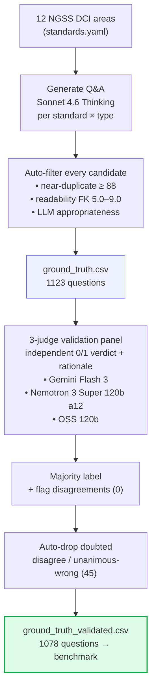

# Ground-truth dataset: how it was built
_Generated 2026-07-15 20:42 UTC._

## Overview
A ground-truth question–answer set for **12 NGSS middle-school science areas** was generated by **Sonnet 4.6 Thinking** (target 100 questions/area, types: recall 34, conceptual 33, applied 33), then independently validated by a **3-judge LLM panel**: Gemini Flash 3, Nemotron 3 Super 120b a12, OSS 120b.

Every candidate question passed three automatic gates before entering the set: near-duplicate removal (rapidfuzz token-set ratio ≥ 88), a middle-school readability band (Flesch–Kincaid 5.0–9.0), and an LLM appropriateness check; failures were dropped and regenerated for the same (area, standard, type) slot until the target was met.

## Pipeline

Steps (text)

1. **Standards** — 12 NGSS DCI areas (`data/standards.yaml`).
2. **Generate** — Sonnet 4.6 Thinking writes Q&A per standard × question type.
3. **Auto-filter** — dedupe + readability band + LLM appropriateness gate.
4. **ground_truth.csv** — 1123 questions kept.
5. **Validate** — 3 judges give independent 0/1 verdicts + rationale.
6. **Majority + flag** — disagreements flagged (0).
7. **Auto-drop** — doubted questions (disagreement or unanimous-wrong) removed automatically (45 dropped); recorded in `results/human_review/auto_dropped_groundtruth.csv`.
8. **ground_truth_validated.csv** — 1078 questions used by the benchmark.

## Counts
- Generated: **1123**
- Validated (final, used by benchmark): **1078**
- Auto-dropped as doubted (disagreement or unanimous-wrong): **45** (recorded in `results/human_review/auto_dropped_groundtruth.csv`; `ground_truth.csv` intact)
- Flagged for human review (judge disagreement): **0**
- Panel majority said *incorrect*: **0**

## Final composition by area
| area | title | questions | standards | recall | conceptual | applied | mean FK |
| --- | --- | --- | --- | --- | --- | --- | --- |
| MS-PS1 | Matter and Its Interactions | 87 | 6 | 23 | 33 | 31 | 7.21 |
| MS-PS2 | Motion and Stability: Forces and Interactions | 91 | 5 | 29 | 31 | 31 | 7.14 |
| MS-PS3 | Energy | 84 | 5 | 22 | 30 | 32 | 6.82 |
| MS-PS4 | Waves and Their Applications in Technologies for Information Transfer | 88 | 3 | 29 | 28 | 31 | 6.7 |
| MS-LS1 | From Molecules to Organisms: Structures and Processes | 89 | 8 | 29 | 31 | 29 | 7.0 |
| MS-LS2 | Ecosystems: Interactions, Energy, and Dynamics | 96 | 5 | 31 | 32 | 33 | 7.13 |
| MS-LS3 | Heredity: Inheritance and Variation of Traits | 85 | 2 | 26 | 29 | 30 | 7.22 |
| MS-LS4 | Biological Evolution: Unity and Diversity | 89 | 6 | 27 | 33 | 29 | 7.46 |
| MS-ESS1 | Earth's Place in the Universe | 96 | 4 | 31 | 33 | 32 | 6.93 |
| MS-ESS2 | Earth's Systems | 94 | 6 | 31 | 31 | 32 | 6.93 |
| MS-ESS3 | Earth and Human Activity | 91 | 5 | 26 | 33 | 32 | 7.54 |
| MS-ETS1 | Engineering Design | 88 | 4 | 25 | 32 | 31 | 7.45 |
| TOTAL |  | 1078 | 59 | 329 | 376 | 373 |  |

## Candidates rejected during generation
4,433 total.

| reason | rejected |
| --- | --- |
| readability out of band | 3591 |
| near-duplicate | 534 |
| LLM appropriateness gate | 308 |

## Original judge agreement
Pairwise percent agreement (over items both judges scored; 1078 scored by all).

| judge | Gemini Flash 3 | Nemotron 3 Super 120b a12 | OSS 120b |
| --- | --- | --- | --- |
| Gemini Flash 3 | — | 100% | 100% |
| Nemotron 3 Super 120b a12 | 100% | — | 100% |
| OSS 120b | 100% | 100% | — |

### By judge model
| judge | items scored | said correct % | agreed w/ majority % |
| --- | --- | --- | --- |
| Gemini Flash 3 | 1078 | 100.0 | 100.0 |
| Nemotron 3 Super 120b a12 | 1078 | 100.0 | 100.0 |
| OSS 120b | 1078 | 100.0 | 100.0 |
